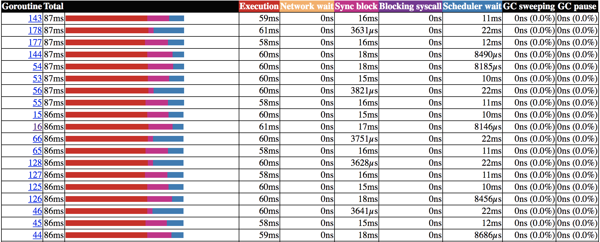
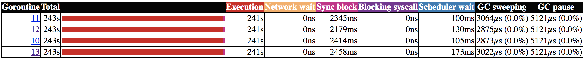
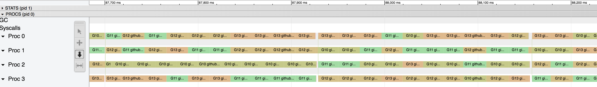

# jacobi-go
[](https://circleci.com/gh/mcanalesmayo/jacobi-go)
[](https://goreportcard.com/report/github.com/mcanalesmayo/jacobi-go)
[](https://godoc.org/github.com/mcanalesmayo/jacobi-go)
[](https://raw.githubusercontent.com/mcanalesmayo/jacobi-go/master/LICENSE)

## Description
Go implementation of a simulation of thermal transmission in a 2D space.

The purpose of this project is to compare the performance of a single-threaded implementation with a multithreaded one. Additionally, they can be compared with a single-threaded, multithreaded and distributed C implementation available in [this repo](https://github.com/mcanalesmayo/jacobi-mpi).

The simulation algorithm is really simple:
```
Algorithm thermalTransmission is:
  Input: initialValue, numDimensions, maxIters, tolerance
  Output: matrix

  nIters <- 0
  maxDiff <- MAX_NUM
  prevIterMatrix <- initMatrix(initialValue, numDimensions)
  matrix <- initEmptyMatrix(numDimensions)

  while maxDiff > tolerance AND nIters < maxIters do
    for each (i,j) in prevIterMatrix do
      matrix[i,j] <- arithmeticMean(prevIterMatrix[i,j],
        prevIterMatrix[i-1,j], prevIterMatrix[i+1,j]
        prevIterMatrix[i,j-1], prevIterMatrix[i,j+1])
    end

    maxDiff <- maxReduce(absoluteValue(prevIterMatrix-matrix))
    nIters++
    prevIterMatrix <- matrix
  end
```

## Run and analyze benchmarks
By using the built-in tools we can easily run the benchmark and take a look at some hardware metrics to analyze the performance of the application. As prerequisite for visualizing the metrics, GraphViz must be installed.

To run the benchmark:
```
cd jacobi-go
# For CPU and memory profiles
go test -v -cpuprofile=cpuprof.out -memprofile=memprof.out -bench=. benchmark/benchmark_test.go
# For traces
go test -v -trace=trace.out -bench=. benchmark/benchmark_test.go
```

To visualize the cpu metrics (same thing works for memory metrics) in PNG format or via web browser:
```
go tool pprof -png cpuprof.out
go tool pprof -http=localhost:8080 cpuprof.out
```

For traces another built-in tool has to be used, which allows to visualize the metrics via web browser:
```
go tool trace -http=localhost:8080 trace.out
```

## Results
The following results were gathered by running the benchmark in a MacBook Pro with an i7-7820HQ (4 cores):

| Routines | Initial Value | Each dimension size | Max iters | Max diff | ns/op        | Speedup over single routine version |
|----------|---------------|---------------------|-----------|----------|--------------|-------------------------------------|
| 1        | 0.5           | 16                  | 1000      | 1.0e-3   | 3801827      | N/A                                 |
| 1        | 0.5           | 64                  | 1000      | 1.0e-3   | 223633618    | N/A                                 |
| 1        | 0.5           | 256                 | 1000      | 1.0e-3   | 3410725471   | N/A                                 |
| 1        | 0.5           | 1024                | 1000      | 1.0e-3   | 55885176608  | N/A                                 |
| 1        | 0.5           | 4096                | 1000      | 1.0e-3   | 897391537991 | N/A                                 |
| 4        | 0.5           | 16                  | 1000      | 1.0e-3   | 7995262      | 0,4755                              |
| 4        | 0.5           | 64                  | 1000      | 1.0e-3   | 102926714    | 2,1728                              |
| 4        | 0.5           | 256                 | 1000      | 1.0e-3   | 1085940009   | 3,1408                              |
| 4        | 0.5           | 1024                | 1000      | 1.0e-3   | 16899117229  | 3,3070                              |
| 4        | 0.5           | 4096                | 1000      | 1.0e-3   | 255977729080 | 3,5057                              |

The below routines are a small sample after the benchmark converged into solutions with similar resulting time for a 16x16 matrix solved by 4 routines:


Same for 64x64:



For 256x256:


For 1024x1024:


For 4096x4096:



Taking a deeper look into the traces, we can see that for the 16x16 problem it's not worth to run several routines, as the execution time is almost hidden by the send<->receive synchronization, as for each iteration all workers need to share the outer cells of their subproblem and also reduce the max value of the diff. Keep in mind that the scale of the following image is in µs and there are a lot of holes, which can be considered as synchronization points:


Same for 4096x4096, notice the scale of the traces is bigger (ms) and there are way less synchronization points. The execution time in this case hides the synchronization time:



It makes sense that for small matrix sizes it's not worth to use multithreading capabilities as there's a significant communication/synchronization overhead. As shown in the table, the speedup of the 4 routines version vs the single routine version for a 16x16 matrix was `0,4755`, which means it's around 2 times slower. With the 64x64 matrix we got a better result, 2 times faster. Progressively increasing the matrix size of the experiments will hide more and more the synchronization time and will end up reaching values close to 4, which is the number of cores of the CPU used in these experiments. This is because the workload that can be run in parallel (independent workload) will be close to 100% of the program workload.

Computing the inner cells values of the worker matrix (its assigned subproblem) is the main independent workload. The time of this workload depends on `(n-1)*(n-1)`, which is `O(n^2)`, being `n` the size of the worker matrix. The only workload which isn't parallelized is the max reduce, which depends on the number of workers (not the size of the matrix), so we can consider it `O(1)`. On the other hand, sharing the outer cells values to adjacent workers will also get hidden by the execution time of computing the inner cells, as the number of outer cells values is `4*n` in the worst case, which makes this workload grow by `O(n)` (less than the inner cells workload: `O(n^2)`).